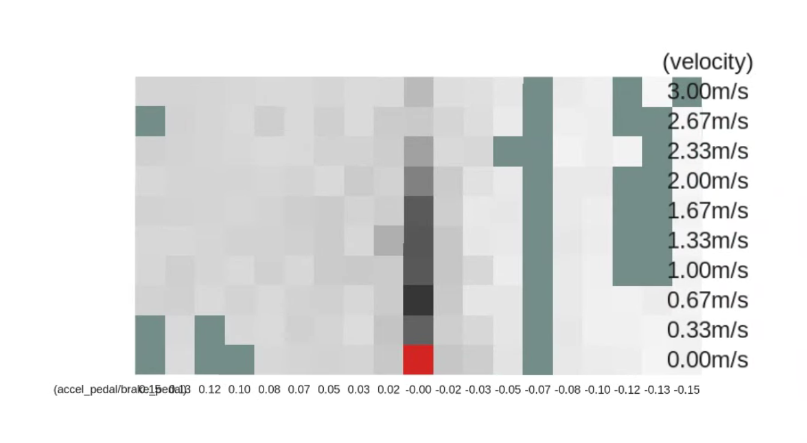
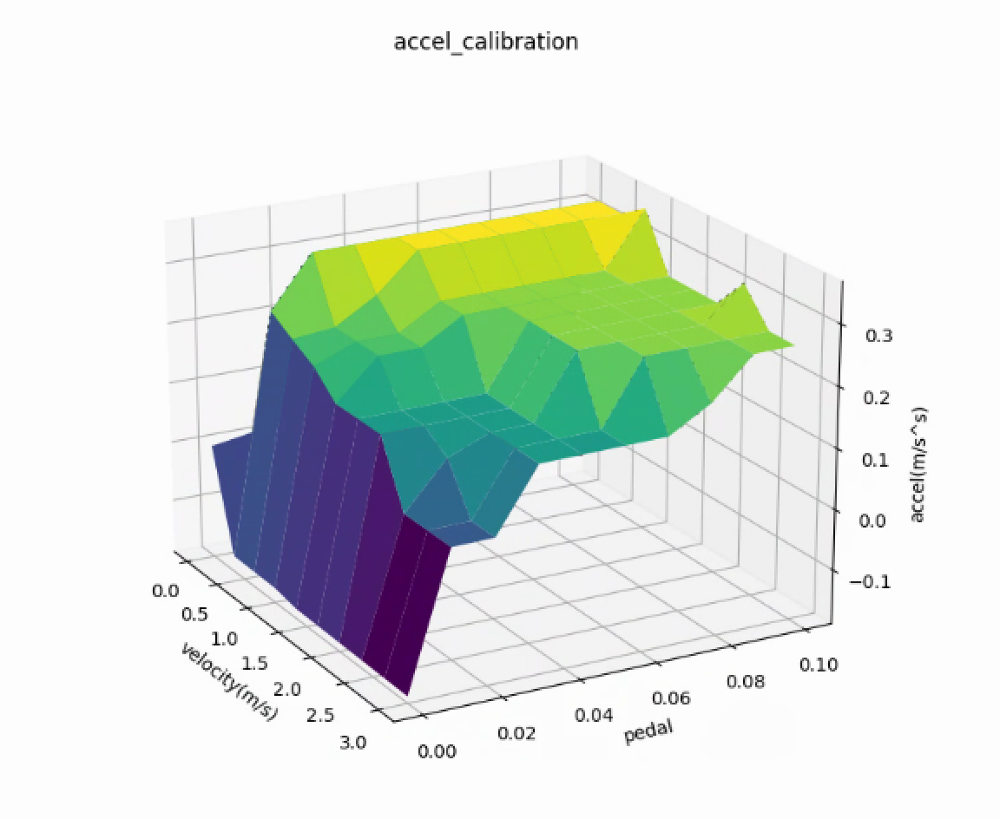
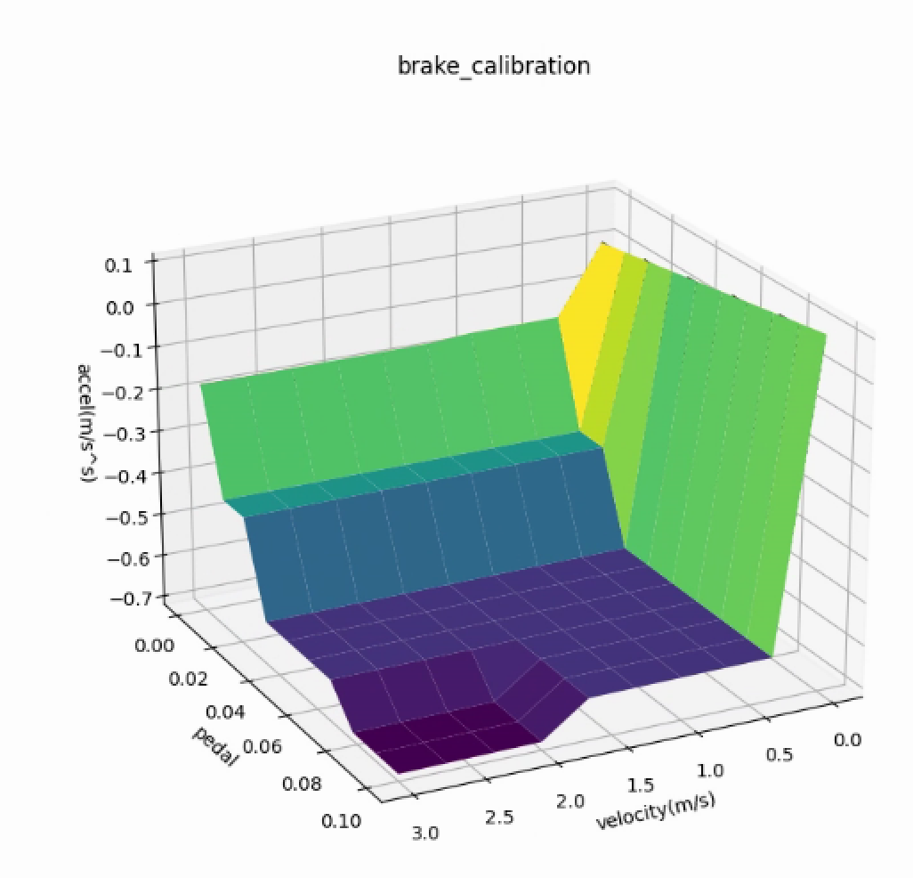

# accel_brake_map_calibrator

The role of this node is to automatically calibrate `accel_map.csv` / `brake_map.csv` that be used in the `raw_vehicle_cmd_converter` node.

The base map, which is lexus's one by default, is updated iteratively with the loaded driving data.

## How to calibrate
### Data Prepare
Before you can calibrate your accel/brake map, you have to prepare your Steering, Pedal, Twist data.
#### manually launch vehicle/sensors drivers
you can launch all the drivers manually
```sh
# launch socketcan ROS driver
roslaunch socketcan_bridge socketcan_bridge.launch [can_device:=port_of_your_can_device]
```

```sh
# launch ros driver of pix chassis
roslaunch pix_driver pix_driver.launch
```

```sh
# launch ros driver of fixpostion in order to get twist msg
roslaunch fixposition_driver tcp.launch
# convert Odometry msg to Twist msg from fixpostion
rosrun gnss_poser fixpostion_converter.py
```
#### launch vehicle/sensors drivers by launching self-driving software
alternatively, you can launch vehicle/sensors drivers by launching self-driving software, because all the drivers will be launched when the self-driving software launched
```sh
# launch self-driving software
roslaunch autoware_launch autoware_copy2.launch
```

### Now you are able to collect all the msgs you need for calibration
```sh
# msg example
path:        2022-09-29-18-56-05.bag
version:     2.0
duration:    19:58s (1198s)
start:       Sep 29 2022 18:56:05.67 (1664448965.67)
end:         Sep 29 2022 19:16:04.67 (1664450164.67)
size:        109.3 MB
messages:    823489
compression: none [133/133 chunks]
types:       can_msgs/Frame                      [64ae5cebf967dc6aae4e78f5683a5b25]
             geometry_msgs/TwistStamped          [98d34b0043a2093cf9d9345ab6eef12e]
             pix_driver_msgs/brake_report_501    [3480f5e3b8357be755086ba3835dc248]
             pix_driver_msgs/steering_report_502 [a8423dd103d4ee6cbb38b886b2eedf16]
             pix_driver_msgs/throttle_report_500 [87b7573ebd84d77a287155f138007e3d]
             rosgraph_msgs/Log                   [acffd30cd6b6de30f120938c17c593fb]
             sensor_msgs/Imu                     [6a62c6daae103f4ff57a132d6f95cec2]
topics:      /fixposition/poiimu                   119862 msgs    : sensor_msgs/Imu                    
             /localization/twist_estimator/twist   105752 msgs    : geometry_msgs/TwistStamped         
             /pix/brake_report                      58942 msgs    : pix_driver_msgs/brake_report_501   
             /pix/steering_report                   58926 msgs    : pix_driver_msgs/steering_report_502
             /pix/throttle_report                   58375 msgs    : pix_driver_msgs/throttle_report_500
             /rosout                                 1033 msgs    : rosgraph_msgs/Log                   (5 connections)
             /rosout_agg                             1025 msgs    : rosgraph_msgs/Log                  
             /sent_messages                        419574 msgs    : can_msgs/Frame
```

### Launch Calibrator

```sh
roslaunch accel_brake_map_calibrator accel_brake_map_calibrator.launch rviz:=true
```

you will see an rviz window to visualize realtime data you are collecting.

During your collecting, it is better to record a rosbag in order to validate different calibrating algoritms.

```sh
# rosbag example
path:        2022-09-29-18-56-05.bag
version:     2.0
duration:    19:58s (1198s)
start:       Sep 29 2022 18:56:05.67 (1664448965.67)
end:         Sep 29 2022 19:16:04.67 (1664450164.67)
size:        109.3 MB
messages:    823489
compression: none [133/133 chunks]
types:       can_msgs/Frame                      [64ae5cebf967dc6aae4e78f5683a5b25]
             geometry_msgs/TwistStamped          [98d34b0043a2093cf9d9345ab6eef12e]
             pix_driver_msgs/brake_report_501    [3480f5e3b8357be755086ba3835dc248]
             pix_driver_msgs/steering_report_502 [a8423dd103d4ee6cbb38b886b2eedf16]
             pix_driver_msgs/throttle_report_500 [87b7573ebd84d77a287155f138007e3d]
             rosgraph_msgs/Log                   [acffd30cd6b6de30f120938c17c593fb]
             sensor_msgs/Imu                     [6a62c6daae103f4ff57a132d6f95cec2]
topics:      /fixposition/poiimu                   119862 msgs    : sensor_msgs/Imu                    
             /localization/twist_estimator/twist   105752 msgs    : geometry_msgs/TwistStamped         
             /pix/brake_report                      58942 msgs    : pix_driver_msgs/brake_report_501   
             /pix/steering_report                   58926 msgs    : pix_driver_msgs/steering_report_502
             /pix/throttle_report                   58375 msgs    : pix_driver_msgs/throttle_report_500
             /rosout                                 1033 msgs    : rosgraph_msgs/Log                   (5 connections)
             /rosout_agg                             1025 msgs    : rosgraph_msgs/Log                  
             /sent_messages                        419574 msgs    : can_msgs/Frame
```

This graph shows how much validate data you have already collected. The ```green``` grids are reprenting the background color. The darker the grid, the much data you haved collected. Keep pulling the joysticker till all grid turn black.

<p align="center">
  
</p>

During the calibration with setting the parameter `progress_file_output` to true, the log file is output in [directory of *accel_brake_map_calibrator*]/config/ . You can also see accel and brake maps in [directory of *accel_brake_map_calibrator*]/config/accel_map.csv and [directory of *accel_brake_map_calibrator*]/config/brake_map.csv after calibration.

### call saving service
you can use the service to save accel/brake maps.
```sh
rosservice call /save_calibration "path_to_save: data: '[path_to_save]'"
```

### Calibration plugin

The `rviz:=true` option displays the RViz with a calibration plugin as below.

The current status (velocity and pedal) is shown in the plugin. The color on the current cell varies green/red depending on the current data is valid/invalid. The data that doesn't satisfy the following conditions are considered invalid and will not be used for estimation.

- The velocity and pedal conditions are within certain ranges from the index values.
- The steer value, pedal speed, pitch value, etc. are less than corresponding thresholds.
- The velocity is higher than a threshold.

Note: You don't need to worry about whether the current state is red or green during calibration. Just keep getting data until all the cells turn red.

The value of each cell in the map is gray at first, and it changes from blue to red as the number of valid data in the cell accumulates. It is preferable to continue the calibration until each cell of the map becomes close to red. In particular, the performance near the stop depends strongly on the velocity of 0 ~ 6m/s range and the pedal value of +0.2 ~ -0.4, range so it is desirable to focus on those areas.

### Evaluation of the accel / brake map accuracy

The accuracy of map is evaluated by the **Root Mean Squared Error (RMSE)** between the observed acceleration and predicted acceleration.

**TERMS:**

- `Observed acceleration`: the current vehicle acceleration which is calculated as a derivative value of the wheel speed.

- `Predicted acceleration`: the output of the original accel/brake map, which the Autoware is expecting. The value is calculated using the current pedal and velocity.

You can check additional error information with the following topics.

- `/accel_brake_map_calibrator/output/current_map_error` : The error of the original map set in the `csv_path_accel/brake_map` path. The original map is not accurate if this value is large.
- `/accel_brake_map_calibrator/output/updated_map_error` : The error of the map calibrated in this node. The calibration quality is low if this value is large.
- `/accel_brake_map_calibrator/output/map_error_ratio` : The error ratio between the original map and updated map (ratio = updated / current). If this value is less than 1, it is desirable to update the map.

### Evaluation the Linearity of Accel/Brake Map
```sh
# go to "plot" dir
python3 plot_map.py
```
<p align="center">
  
</p>

<p align="center">
  
</p>

### How to visualize calibration data

The process of calibration can be visualized as below. Since these scripts need the log output of the calibration, the `pedal_accel_graph_output` parameter must be set to true while the calibration is running for the visualization.

## Parameters

| Name                     | Type   | Description                                                                                                                                                                       | Default value                                            |
| :----------------------- | :----- | :-------------------------------------------------------------------------------------------------------------------------------------------------------------------------------- | :------------------------------------------------------- |
| update_method            | string | you can select map calibration method. "update_offset_each_cell" calculates offsets for each grid cells on the map. "update_offset_total" calculates the total offset of the map. | "update_offset_each_cell"                                |
| get_pitch_method         | string | "tf": get pitch from tf, "none": unable to perform pitch validation and pitch compensation, "imu": get pitch from imu                                                                                        | "tf"                                                     |
| pedal_accel_graph_output | bool   | if true, it will output a log of the pedal accel graph.                                                                                                                           | true                                                     |
| progress_file_output     | bool   | if true, it will output a log and csv file of the update process.                                                                                                                 | false                                                    |
| default_map_dir          | str    | directory of default map                                                                                                                                                          | [directory of *raw_vehicle_cmd_converter*]/data/default/ |
| calibrated_map_dir       | str    | directory of calibrated map                                                                                                                                                       | [directory of *accel_brake_map_calibrator*]/config/      |
